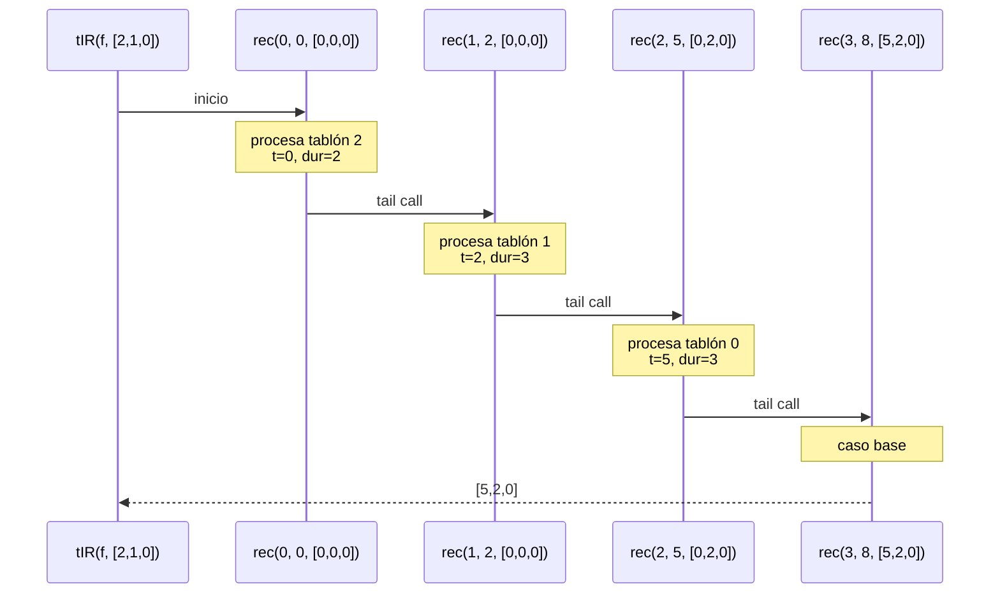

# Algoritmo de programación funciones de costo

<!-- Aqui toca hacer una introduccion general y los temas antes -->
______________________________________________________________
### 9.1 Proceso de la función `tIR`

La función `tIR` calcula el tiempo de inicio de riego de cada tablón siguiendo el orden indicado por la programación `pi`.  
Este proceso se implementa mediante **recursión de cola**, acumulando el tiempo total transcurrido hasta cada turno.

---

#### Descripción operacional

`tIR(f, pi)` funciona de la siguiente forma:

1. Se inicia con tiempoActual = 0.
2. En cada turno `idx`:
  - Se identifica el tablón actual: `tablon = pi(idx)`.
  - Se asigna `t(tablon) = tiempoActual`.
  - Se suma el tiempo de riego del tablón (`treg(f, tablon)`) al tiempo actual.
3. La recursión continúa mientras queden turnos por procesar.
4. Cuando `idx` alcanza la longitud de `pi`, se devuelve el vector final.

---

#### Ejemplo de ejecución

Considere:

```text
F = Vector(
  (5,2,3),   // Tablón 0
  (4,1,1),   // Tablón 1
  (6,3,2)    // Tablón 2
)

pi = Vector(0,2,1)
```

Evolución del proceso:

| Iteración | idx | tablón | tiempoActual | nuevoTiempo | vectorTiempos |
|-----------|-----|--------|--------------|-------------|----------------|
| 0         | 0   | 0      | 0            | 2           | [0,0,0]        |
| 1         | 1   | 2      | 2            | 5           | [0,0,2]        |
| 2         | 2   | 1      | 5            | 6           | [0,5,2]        |

Resultado final:

```scala
tIR(F, pi) = [0, 5, 2]
```

---

#### Pila de llamadas (diagrama)


---

### 9.2 Proceso de la función `costoRiegoTablon`

La función `costoRiegoTablon` calcula el costo individual de un tablón según:
- su tiempo de supervivencia,
- su tiempo de riego,
- su prioridad,
- y el tiempo en que realmente empieza a regarse (obtenido desde `tIR`).

Este proceso involucra una llamada interna importante: **tIR**, la cual es recursiva. Por lo tanto, el proceso total de `costoRiegoTablon` incluye tanto su propia lógica como la ejecución interna de `tIR`.

---

#### Entradas del ejemplo

Usamos la misma finca y programación que en la sección anterior (para mantener coherencia):

```text
F = Vector(
  (5,2,3),   // Tablón 0
  (4,1,1),   // Tablón 1
  (6,3,2)    // Tablón 2
)

pi = Vector(0, 2, 1)

```
---

### 9.3 Proceso de la función `costoRiegoFinca`

La función `costoRiegoFinca` calcula el costo total de riego de una finca sumando el costo individual de cada tablón.  
Su proceso consiste en:

1. Recorrer todos los índices de la finca.
2. Llamar a `costoRiegoTablon(i, f, pi)` para cada `i`.
3. Sumar todos los resultados.

Debido a que cada llamada a `costoRiegoTablon` invoca internamente a `tIR`, el proceso total incluye múltiples ejecuciones del proceso recursivo descrito antes.

---

#### Entradas del ejemplo

Usamos la misma finca y programación:

```text
F = Vector(
  (5,2,3),   // Tablón 0
  (4,1,1),   // Tablón 1
  (6,3,2)    // Tablón 2
)

pi = Vector(0, 2, 1)
```

---

### 9.4 Proceso de la función `costoMovilidad`

La función `costoMovilidad` calcula la suma de las distancias entre tablones consecutivos según la programación de riego `pi`.  
A diferencia de `tIR` o `costoRiegoTablon`, esta función **no contiene recursión**, sino un recorrido secuencial por pares consecutivos.

---

#### Entradas del ejemplo

Usamos la misma programación para coherencia:

```text
pi = Vector(0, 2, 1)
```


# Algoritmo de programación optima en sistemas de riego
El presente informe documenta el proceso de implementación de un sistema funcional para la optimización del riego en cultivos agrícolas, específicamente diseñado para la gestión de fincas divididas en tablones. El problema aborda la programación eficiente del riego considerando restricciones de supervivencia de cultivos, tiempos de regado y costos de movilidad de sistemas móviles de riego.

### **Contexto del Problema:**

En la agricultura moderna, especialmente en regiones como el Valle del Cauca, los cultivos se organizan en tablones con características hídricas específicas. Cada tablón tiene un tiempo de supervivencia (días máximos sin riego), un tiempo de regado (días necesarios para restablecer capacidad hídrica) y una prioridad asignada. El desafío consiste en determinar el orden óptimo de riego que minimice tanto el sufrimiento de los cultivos como los costos operativos.
______________________________________________________________
### 1. Definición de tipos de datos
```scala
type Tablon = (Int, Int, Int) // Esto hace referencia al tiempo de supervivencia, tiempo de regado y prioridad
type Finca = Vector[Tablon] // Este es el vector de tablones
type Distancia = Vector[Vector[Int]] // Esta es la matriz de distancia entre los tablones
type ProgRiego = Vector[Int] // Vector para la programacion de riego
type TiempoInicioRiego = Vector[Int] // Vector con el tiempo de inicio del riego

```
En este aspecto utilizamos tipos inmutables (`Vector`) siguiendo el paradigma funcional puro.

### 2. Generación de entradas aleatorias
**Generación de Finca:**
```scala
def fincaAlAzar(long: Int): Finca = // Aqui implementamos el generar numero de tablones. (el parametro long define el numero de tablones)
    Vector.fill(long)(
      (random.nextInt(long * 2) + 1,
        random.nextInt(long) + 1, // Aqui implementamos el generar duracion de riego (Este valor es el tiempo del regado)
        random.nextInt(4) + 1)
    )
```
**Función de alto orden:** `Vector.fill` genera `long` tablones aplicando la funcion generadora.

**Ejemplo para `long = 3`**
Vector.fill(3)(...)
Evalua la funcion 3 veces $[(t_s{}_1, t_r{}_1, p_1),\ (t_s{}_2, t_r{}_2, p_2),\ (t_s{}_3, t_r{}_3, p_3)]$

**Generación de matriz de distancia**
```scala
def distanciaAlAzar(long: Int): Distancia = { // Aqui implementamos el generar distancias
    val v = Vector.fill(long, long)(random.nextInt(long * 3) + 1)
    Vector.tabulate(long, long)((i, j) =>
      if (i == j) 0
      else if (i < j) v(i)(j)
      else v(j)(i)
    )
  }
```
Aqui tambien encontramos una función de alto valor `Vector.tabulate` que genera la matriz aplicando funcion a cada par $(i,j)$.

**Proceso que garantiza la simetria:** 
* **Diagonal:** $\quad D[i,i] = 0$
* **Triangulo superior:** Valores aleatorios
* **Triangulo inferior:** Copia simetrica $\quad D[i,j] = D[j,i]$.

### 3. Funciones de exploración
```scala
def tsup(f: Finca, i: Int): Int = f(i)._1 // Tiempo de supervivencia

  def treg(f: Finca, i: Int): Int = f(i)._2 // Tiempo de regado

  def prio(f: Finca, i: Int): Int = f(i)._3 // Prioridad
```
**Funciones puras:** Acceso inmutable a componentes de la tupla sin efectos secundarios.

### 4. Calculo del tiempo de inicio de riego (tIR)
$Dada \Pi = \langle \pi_0, \pi_1, \ldots, \pi_{n-1} \rangle:$

$t^\Pi_{\pi_0} = 0$
$t^\Pi_{\pi_j} = t^\Pi_{\pi_{j-1}} + tr^F_{\pi_{j-1}}, \qquad j = 1, \ldots, n-1$

**Implementación con recursion de cola:**
```scala
 def tIR(f: Finca, pi: ProgRiego): TiempoInicioRiego = {
    @tailrec
    def rec(idx: Int, tiempoActual: Int, resultado: TiempoInicioRiego): TiempoInicioRiego =
      if (idx >= pi.length) resultado
      else {
        val tablonActual = pi(idx)
        val nuevoResultado = resultado.updated(tablonActual, tiempoActual)
        val nuevoTiempo = tiempoActual + treg(f, tablonActual)
        rec(idx + 1, nuevoTiempo, nuevoResultado)
      }

    rec(0, 0, Vector.fill(f.length)(0))
  }
```
**Acumuladores:**
* `idx:` Posicion actual en la programación
* `tiempoActual:` Tiempo transcurrido acumulado
* `resultado:` Vector con tiempos de inicio calculados

En cuanto a complejidad: Se maneja $O(n)$ tiempo, $O(1)$ espacio (por optimización tail-call)

**Ejemplo de ejecución:**
**Entradra:** F = [(10,3,4), (5,3,3), (2,2,1)]     Π = [2, 1, 0]

**Pila de llamadas:**
$$
\begin{align*}
\text{rec}(0,0,[0,0,0])
&\rightarrow \text{rec}(1,2,[0,0,0]) \\
&\rightarrow \text{rec}(2,5,[0,2,0]) \\
&\rightarrow \text{rec}(3,8,[5,2,0]) \\
&\rightarrow [5,2,0]
\end{align*}
$$

**Resultado:** [5, 2, 0] significa tablón 0 inicia en t = 5, tablón 1 en t = 2, tablón 2 en t = 0.

### **Diagrama de proceso:**


### 5. Funciones de validación:
**Validación de finca:**
```scala
def validarFinca(f: Finca): Boolean =
    f.forall { case (ts, tr, p) =>
      ts > 0 && tr > 0 && p > 0 && p <= 4
    }
```
**Función de alto orden:** `forall` comprueba predicado para todos los elementos.

**Proceso:** 
$f.forall(pred) -> pred(f(0)) ∧ pred(f(1)) ∧ ... ∧ pred(f(n-1))$

**Validación de distancias:**
```scala
 def validarDistancias(d: Distancia): Boolean =
    d.indices.forall(i =>
      d(i).length == d.length &&
        d(i)(i) == 0 &&
        d.indices.forall(j => d(i)(j) == d(j)(i) && d(i)(j) >= 0)
    )
```
**Verifica:** 
* Matriz cuadrada: $ \quad |d_i| = |d| \quad \text{para todo } i$
* Diagonal Nula: $\quad d_{ii} = 0 \quad \text{para todo } i$
* Simetrica: $\quad d_{ij} = d_{ji} \quad \text{para todo } i,j$
* No negatividad: $\quad d_{ij} \ge 0 \quad \text{para todo } i,j$

**Confirmamos la programación:** 
```scala
def validarProgRiego(pi: ProgRiego, n: Int): Boolean =
    pi.length == n && pi.toSet == (0 until n).toSet
```
Verifica la permutación valida:
* **Longitud correcta:** $\quad |\Pi| = n$
* **Sin repeticiones:** $ \quad |\text{Set}(\Pi)| = |\Pi|$
* **Contiene todos los indices:** $\quad \text{Set}(\Pi) = \{0,1,\ldots,n-1\}$

### Las integraciones de conceptos funcionales son:
**Imutabilidad:** Todas las estructuras son `Vector` inmutables, `updated` retorna un nuevo Vector sin modificar el original, no hay variables `var` ni efectos secundarios.

**Funciones de alto orden:**
`Vector.fill` esta es generado con una función, `Vector.tabulate` construcción indexada, `forall` validación universal, `map`, `zipWithIndex` -> trasnsformaciones.

**Recursión de cola:** Anotación `@tailrec` nos garantiza la optimización, compilador transforma un bucle iterativo eficiente.

**Composición funcional:** Funciones puras que se componen por `treg(f, pi(idx))`, separación de responsabilidades como en generación, validación y calculo, sin dependencias de estado global.

### 1. Permutaciones: generación de todas las rutas

### Definicion de algoritmo
```Scala
def permutaciones(tablas: Vector[Int]): Vector[ProgRiego] = {
if (tablas.isEmpty) Vector(Vector())
else {
for {
i <- tablas.indices.toVector
elem = tablas(i)
resto = tablas.patch(i, Nil, 1)
perm <- permutaciones(resto)
} yield elem +: perm
}
}
```
Explicación del proceso

Si el vector está vacío - solo existe una permutación: Vector().

En caso contrario:

- Se recorre cada índice
- Se toma un tablón como fijo
- Se generan las permutaciones del resto 
- Se pone el elemento fijo a cada permutación generada

Este diseño sigue la definición matemática recursiva estándar de permutaciones

### 2. Generación de programaciones

```Scala
def generarProgramaciones(f: Finca): Vector[ProgRiego] =
permutaciones((0 until f.length).toVector)
```

- Representa la finca como índices [0, 1, ..., n−1].

- Luego obtiene todas sus permutaciones.

### 3. Validaciones

#### 3.1 No hay tablones repetidos
```Scala
def noRepiteTablones(pi: ProgRiego): Boolean =
pi.distinct.length == pi.length
```
Garantiza unidad mediante operaciones de conjuntos

#### 3.2 Se incluyen todos los tablones
```Scala
def contieneTodos(f: Finca, pi: ProgRiego): Boolean =
pi.toSet == (0 until f.length).toSet
```
Verifica igualdad entre conjuntos


#### 4. Cálculo de costos
```Scala
def costoTotal(f: Finca, pi: ProgRiego, d: Distancia): Int = {
costoRiegoFinca(f, pi) + costoMovilidad(f, pi, d) }
```
Separar los costos cumple el principio funcional de composición de funciones puras.

Formula formal:

$$
\mathrm{CostoTotal}(\pi)
= \sum_{i \in \pi} f.\mathrm{tIR}(i)
\;+\;
\sum_{(a,b) \in \mathrm{pares}(\pi)} d(a,b)
$$

#### 5. Programación optima
```Scala
val todas = generarProgramaciones(f)
todas.map(pi => (pi, costoTotal(f, pi, d))).minBy(_._2)
```

Proceso:

- Genera todas las rutas posibles
- Calcula costoTotal para cada ruta
- Selecciona la de mínimo costo

#### 6. Integración de conceptos vistos en clase
- Recursión 
- Funciones puras
- Funcional: uso de map, distinct, flatMap, minBy
- Declaratividad
- Búsqueda en espacios discretos 
- Composición funcional

#### 7. Ejemplo con datos reales
Finca:

```Scala
Finca(Vector(3,1,4))
```
T = [0,1,2]
Perm(T) → 6 rutas posibles.

Ejemplo de cálculo:

π = [0,2,1]

Riego = 3 + 4 + 1 = 8

Movilidad = |0-2| + |2-1| = 2 + 1 = 3

CostoTotal = 11

<!-- ahí dejé el resto del ejemplo, toca borrarlo -->
________________________________________________________________________________
# Informe de proceso Algoritmo Factorial con Recursión de Cola

## Definición del Algoritmo

```Scala
def factorial(n: Int): BigInt = {
  @annotation.tailrec
  def loop(x: Int, acumulador: BigInt): BigInt = {
    if (x <= 1) acumulador
    else loop(x - 1, acumulador * x)
  }
  loop(n, 1)
}
```

- La función `factorial` calcula el factorial de un número `n` utilizando **recursión de cola**.
- La función interna `loop` es la que hace la recursión:
  - Recibe dos parámetros:
    - `x`: el valor actual decreciente hasta llegar a 1.
    - `acumulador`: donde se guarda el resultado parcial en cada paso.

- El decorador `@annotation.tailrec` obliga a que la función sea optimizada como recursión de cola, es decir, **no se acumulan llamados en la pila**.

## Explicación paso a paso

### Caso base

```Scala
if (x <= 1) acumulador
```

Cuando `x` llega a `1`, la función retorna directamente el valor acumulado, evitando más llamadas.

### Caso recursivo

```Scala
loop(x - 1, acumulador * x)
```

En cada llamada:

- Se reduce el valor de `x` en 1.
- Se multiplica el acumulador por `x` y se pasa a la siguiente iteración.
- Como es recursión de cola, la llamada recursiva es la **última instrucción** en ejecutarse, lo que permite a Scala optimizar la pila.

---

## Llamados de pila en recursión de cola

Ejemplo:

```Scala
factorial(5)
```

### Paso 1: Llamada inicial

```Scala
loop(5, 1)
```

### Paso 2: Primera iteración

```Scala
loop(4, 5)   // acumulador = 1 * 5
```

### Paso 3: Segunda iteración

```Scala
loop(3, 20)  // acumulador = 5 * 4
```

### Paso 4: Tercera iteración

```Scala
loop(2, 60)  // acumulador = 20 * 3
```

### Paso 5: Cuarta iteración

```Scala
loop(1, 120) // acumulador = 60 * 2
```

### Paso 6: Caso base

```Scala
return 120
```

---

## Diferencia con recursión normal

- En **recursión normal** cada llamada queda en la pila esperando a que termine la siguiente, lo que puede causar desbordamiento si `n` es muy grande.
- En **recursión de cola**, el compilador transforma el proceso en un **bucle optimizado**, por lo que no se guarda cada llamada en la pila y el algoritmo puede ejecutarse para valores muy grandes sin problema.

---

## Ejemplo de uso

```Scala
val resultado = factorial(5)
println(resultado)  // 120
```

El resultado de `factorial(5)` es `120`.

## Diagrama de llamados de pila con recursión de cola


